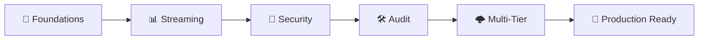

# 🚀 KodeKloud Engineer - Terraform Level 3 Solutions

<div align="center">


*Master Advanced Infrastructure Orchestration with Production-Ready Terraform Solutions*

[](https://kodekloud.com) 
[](#documentation) 
[](#tasks-overview) 
[](#getting-started)

</div>

---

## 📌 About This Repository

This repository provides **comprehensive, production-ready solutions** for the **KodeKloud Engineer Terraform Level 3** challenges. The solutions documented here cover high-level architectural patterns, including advanced streaming with Kinesis, data security with KMS, and complex dynamic provisioning using `for_each` and custom lifecycle logic. **Note**: Specific values (e.g., resource names, regions, or account IDs) in these tasks may differ from your environment. However, the underlying concepts—such as `local-exec` provisioners, STS identity retrieval, and SecureString SSM parameters—remain universally applicable.

**🎯 Mission**: Empower DevOps professionals to master the most complex Terraform scenarios, focusing on auditability, security-at-rest, and scalable dynamic infrastructure.

**⏱️ Timeline**: All 10 tasks documented so far have been successfully completed.

---

## 📈 Learning Journey

<div align="center">

### 🛤️ Your Advanced Infrastructure Path


</div>

| Phase | Skills Gained | Tasks | Completion |
|-------|---------------|--------|------------|
| **🔑 Foundation** | DynamoDB Seeding, Firehose Pipelines | 1-2 |  |
| **🔐 Security** | IAM Governance, KMS Encryption, STS | 3-5 |  |
| **🌩️ Advanced** | SSM SecureString, for_each, Lifecycle | 6-7 |  |
| **🧩 Modules & Workspaces** | Reusable Modules, Sensitive Variables, Workspaces | 8-10 |  |

---

## 🏗️ Complete Task Catalog

<details open>
<summary><b>📊 Data & Streaming (Tasks 1-2)</b> - Click to expand</summary>

| # | Task Name | Status | Complexity | Description |
|---|-----------|--------|------------|-------------|
| 1 | [**DynamoDB Seeding**](./task-01/task-01-terraform-dynamodb-table-items.md) | ✅ **Done** | 🟡 Inter. | Provisioning NoSQL tables and seeding data |
| 2 | [**Firehose Pipeline**](./task-02/task-02-terraform-kinesis-firehose-s3.md) | ✅ **Done** | 🔴 Adv. | Streaming pipelines with S3 delivery & IAM STS |

</details>

<details open>
<summary><b>🔐 Security & Identity (Tasks 3-5)</b> - Click to expand</summary>

| # | Task Name | Status | Complexity | Description |
|---|-----------|--------|------------|-------------|
| 3 | [**IAM Governance**](./task-03/task-03-terraform-iam-user-role-locals-naming.md) | ✅ **Done** | 🟡 Inter. | Enforcing naming conventions via `locals` |
| 4 | [**Audit Logging**](./task-04/task-04-terraform-kinesis-s3-sts-provisioner.md) | ✅ **Done** | 🔴 Adv. | tracking resource events via `local-exec` |
| 5 | [**KMS Encryption**](./task-05/task-05-terraform-kms-encryption.md) | ✅ **Done** | 🔴 Adv. | Mastering data encryption at rest with KMS |

</details>

<details open>
<summary><b>🌩️ Advanced Orchestration (Tasks 6-7)</b> - Click to expand</summary>

| # | Task Name | Status | Complexity | Description |
|---|-----------|--------|------------|-------------|
| 6 | [**Multi-Tier Apps**](./task-06/task-06-terraform-multi-tier-infrastructure.md) | ✅ **Done** | 🟡 Inter. | Secure SSM config, SNS, and DynamoDB stacks |
| 7 | [**Dynamic Storage**](./task-07/task-07-terraform-s3-for-each-lifecycle.md) | ✅ **Done** | 🔴 Adv. | Scalable S3 with `for_each` and lifecycle rules |

</details>

<details open>
<summary><b>🧩 Modules & Advanced Concepts (Tasks 8-10)</b> - Click to expand</summary>

| # | Task Name | Status | Complexity | Description |
|---|-----------|--------|------------|-------------|
| 8 | [**Static Site Module**](./task-08/task-08-terraform-s3-static-site-module.md) | ✅ **Done** | 🟡 Inter. | Building reusable modules for S3 website hosting |
| 9 | [**Secrets Manager**](./task-09/task-09-terraform-secrets-manager.md) | ✅ **Done** | 🔴 Adv. | Handling sensitive variables and AWS Secrets |
| 10 | [**Workspaces & API Gateway**](./task-10/task-10-terraform-api-gateway-workspaces.md) | ✅ **Done** | 🔴 Adv. | Using `count` and workspaces for multi-env APIs |

</details>

---

## 🚦 Getting Started

### 🔧 Prerequisites Checklist

<table>
<tr>
<td width="50%">

**🛠️ Required Tools**
```bash
✅ Terraform >= 1.5.0
✅ AWS CLI >= 2.0
✅ Git >= 2.0
```

</td>
<td width="50%">

**☁️ AWS Requirements**
```bash
✅ Active AWS Account
✅ KMS & IAM Permissions
✅ LocalStack Support
```

</td>
</tr>
</table>

### ⚡ Quick Setup Instructions
```bash
# 1️⃣ Clone Repository
git clone https://github.com/MiqdadProjects/kodekloud-terraform-level-3-solution.git

cd kodekloud-terraform-level-3-solution

# 2️⃣ Configure AWS
aws configure

# 3️⃣ Verify Installation
terraform version && aws sts get-caller-identity

# 4️⃣ Deploy Task 01
cd task-01
terraform init && terraform plan && terraform apply
```

---

## 📚 Documentation Excellence

### 🎯 What You Get With Each Task

<div align="center">

| Component | Description | Value |
|-----------|-------------|-------|
| 📋 **Task Analysis** | Requirements breakdown & objectives | Understand the WHY |
| 🔧 **Infrastructure Design** | Architecture diagrams & resource relationships | Visualize the solution |
| 💻 **Complete Code** | Production-ready Terraform configurations | Copy-paste ready |
| ✅ **Verification** | Testing procedures & validation steps | Confirm success |

</div>

---

## 💡 Additional Tips

- **Locals**: Use `locals` for complex string manipulation and name sanitization (Task 3).
- **Provisioners**: Use `local-exec` for generation of local audit logs (Task 4).
- **Encryption**: Always prefer `SecureString` in SSM and KMS keys for data-at-rest protection (Tasks 5, 6).
- **Lifecycle**: Use `ignore_changes` to prevent manual tag modification from breaking your state (Task 7).

---

## 📊 Repository Analytics

<div align="center">

### 📈 Project Statistics


### 🎯 Learning Impact

| Metric | Current | Target | Status |
|--------|---------|--------|---------|
| **Tasks Completed** | 10/10 | 10/10 |  |
| **Complexity Level** | 🔴 Advanced | Advanced |  |

</div>

---

## 📜 License & Attribution

This project is licensed under the **MIT License**. Created by the **Nautilus DevOps Team** for the DevOps Community.

---

### ⭐ **If this repository helps you, please give it a star!** ⭐

**Contact:** miqdadraja562@gmail.com | **GitHub:** [@MiqdadProjects](https://github.com/MiqdadProjects)